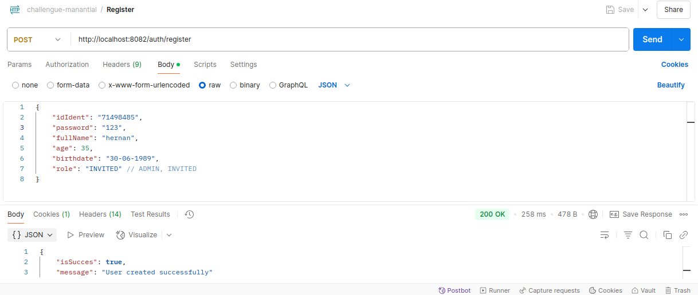
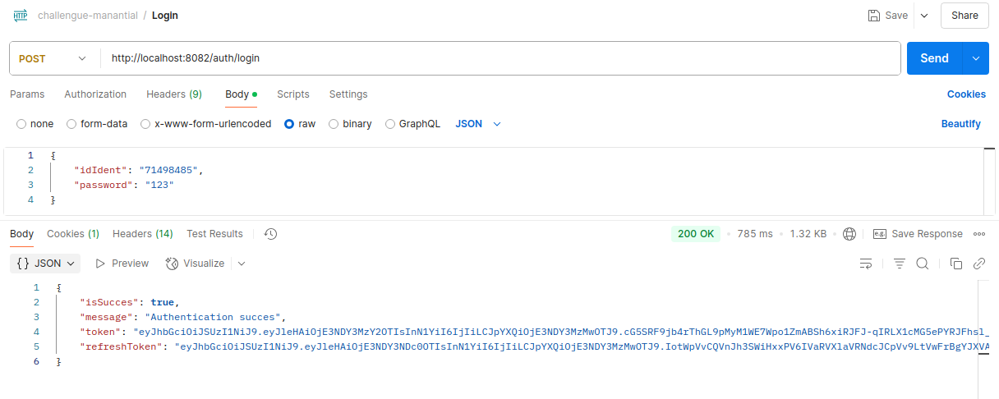
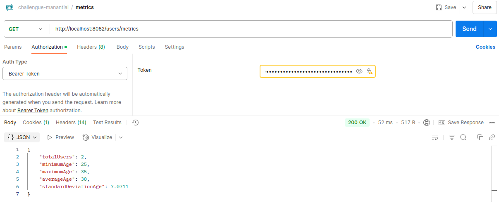
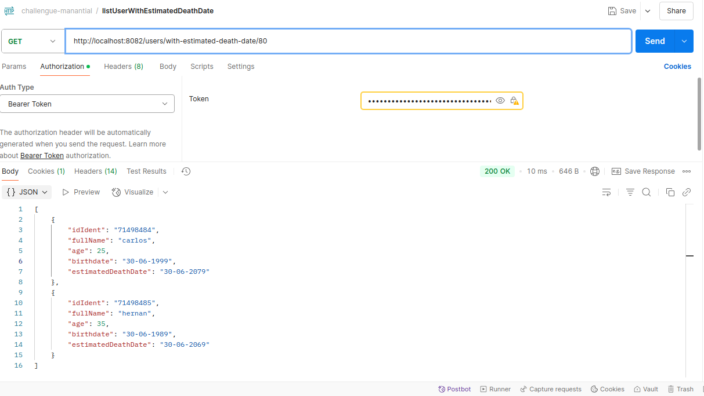

# Sistema de gestión de clientes con Spring Boot

Microservicio que permita manejar el registro, consulta y análisis de datos de clientes

## Funcionalidades
- Crear nuevos clientes mediante un endpoint que permita registrar nombre,
  apellido, edad y fecha de nacimiento.
- Consultar un conjunto de métricas sobre los clientes existentes, como el
  promedio de edad y la desviación estándar de las edades.
- Listar todos los clientes registrados con sus datos completos y un cálculo
  derivado, como una fecha estimada para un evento futuro basado en los
  datos del cliente (por ejemplo, esperanza de vida).

## Requisitos

- Spring Boot
- PostgreSQL
- Java 17
- Postman
- Intellij idea

## Base de datos PostgreSQL
1. CREATE:
   ```bash
    CREATE DATABASE customermanagement;

## Instalación
1. Clonar el repositorio:
   ```bash
   git clone https://github.com/carjizo/customer-management.git
2. Configurar archivo: customer-management/src/main/resources/application-dev.properties
    ```bash
    server.port={port} // ejemplo: 8082
    spring.application.name=customer-management
    spring.jpa.hibernate.ddl-auto=update
    spring.datasource.url=jdbc:postgresql://localhost:5432/customermanagement
    spring.datasource.username=postgres
    spring.datasource.password={passworDB} // password del usuario postgres
    spring.jpa.database-platform=org.hibernate.dialect.PostgreSQLDialect
    jwtKeys.privateKeyPath=jwtKeys/private.key.pem
    jwtKeys.publicKeyPath=jwtKeys/public.key.pem
    env.expiration.time.token=3600000
    env.expiration.time.refresh.token=14400000
## Inicializa la aplicación
    Run CustomerManagementApplication.java

## Validar funcionalidades 
1. Registrar usuario
    ```bash
   // url: http://localhost:8082/auth/register
   // method: POST
   // BODY: 
   {
    "idIdent": "71498485",
    "password": "123",
    "fullName": "hernan",
    "age": 35,
    "birthdate": "30-06-1989",
    "role": "INVITED" // ADMIN, INVITED
    }
    ```
   
   
2. Obtener JWT (Login)
    ```bash
   // url: http://localhost:8082/auth/login
   // method: POST
   // BODY: 
   {
    "idIdent": "71498485",
    "password": "123"
    }
    ```
   
3. Conjunto de métricas (total usuarios, edad max, edad min, promedio de edad y desviación estándar de las edades)
    ```bash
   // url: http://localhost:8082/users/metrics
   // method: GET
   // Authorization: Bearer Token ('token')
   // el token se obtiene de la respuesta del end point anterior '/auth/login'
    ```
   
4. Listar todos los clientes registrados con sus datos completos, con una fecha estimada de su esperanza de vida
    ```bash
   // url: http://localhost:8082/users/with-estimated-death-date/77
   // method: GET
   // Se pasa el parámetro 77 ('significa que es la esperanza de vida en Perú')
   // fuente del valor anterior 'http://datosmacro.expansion.com/demografia/esperanza-vida/peru'
   // Authorization: Bearer Token ('token')
   // el token se obtiene de la respuesta del end point anterior '/auth/login'
    ```
   